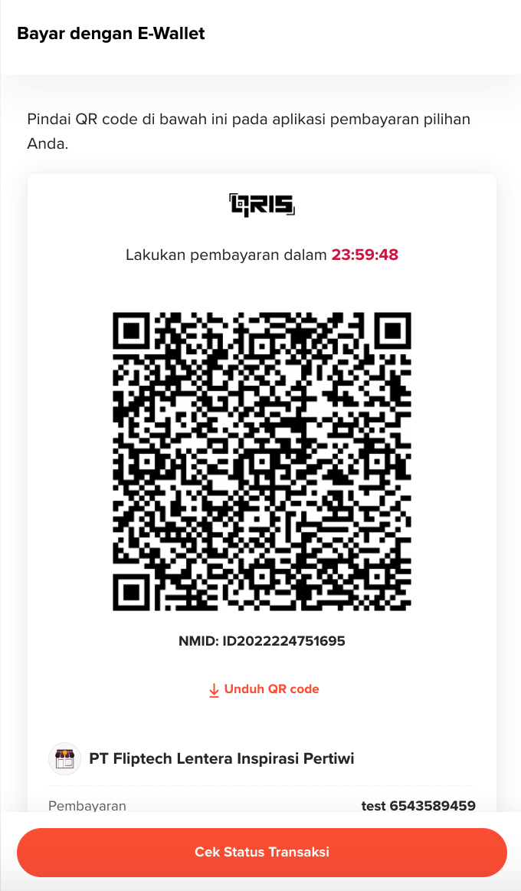

<div></div>

## Create Bill

An endpoint to create a payment/bill link.

<table>
  <tbody>
    <tr>
      <td>Method</td>
      <td><span class="method post">POST</span></td>
    </tr>
    <tr>
      <td>Production URL</td>
      <td><code>https://bigflip.id/api/v2/pwf/bill</code></td>
    </tr>
    <tr>
      <td>Sandbox URL</td>
      <td><code>https://bigflip.id/big_sandbox_api/v2/pwf/bill</code></td>
    </tr>
  </tbody>
</table>

<h3 id="create-bill-request-headers">Request Headers</h3>

```http
POST /pwf/bill HTTP/1.1
Content-Type: application/x-www-form-urlencoded
Authorization: Basic <secret_key>: (notes with ":" after secret key)
```

<table>
  <tbody>
    <tr>
      <td>
        <p><b>Content-Type</b> <em>required</em></p>
        Request content type: <code>application/x-www-form-urlencoded</code>
      </td>
    </tr>
  </tbody>
</table>

<h3 id="create-bill-request-parameters">Request Parameters</h3>

```php
<?php

$ch = curl_init();
$secret_key = "yoursecretkeyhere";

curl_setopt($ch, CURLOPT_URL, "https://bigflip.id/api/v2/pwf/bill");
curl_setopt($ch, CURLOPT_RETURNTRANSFER, TRUE);
curl_setopt($ch, CURLOPT_HEADER, FALSE);

curl_setopt($ch, CURLOPT_POST, TRUE);

$payloads = [
  "title" => "Coffee Table",
  "amount" => 900000,
  "type" => "SINGLE",
  "expired_date" => "2022-12-30 15:50:00",
  "redirect_url" => "https://someurl.com",
  "is_address_required" => 0,
  "is_phone_number_required" => 0
];

curl_setopt($ch, CURLOPT_POSTFIELDS, http_build_query($payloads));

curl_setopt($ch, CURLOPT_HTTPHEADER, array(
  "Content-Type: application/x-www-form-urlencoded"
));

curl_setopt($ch, CURLOPT_USERPWD, $secret_key.":");

$response = curl_exec($ch);
curl_close($ch);

var_dump($response);
```

```shell
curl https://bigflip.id/api/v2/pwf/bill \
  -X POST \
  -u <secret_key>:\
  -H "Content-Type=application/x-www-form-urlencoded" \
  -d "title=Coffee Table" \
  -d "amount=900000" \
  -d "type=SINGLE" \
  -d "expired_date=2022-12-30 15:50:00" \
  -d "redirect_url=https://someurl.com" \
  -d "is_address_required=0" \
  -d "is_phone_number_required=0"
```

<table>
  <tbody>
    <tr>
      <td>
        <p><b>title</b> <em>required</em></p>
        The title of the bill.
        <table class="validation-table">
          <thead>
            <tr>
              <th>Validation</th>
            </tr>
          </thead>
          <tbody>
            <tr>
              <td>
                <ul>
                  <li>Alphanumeric</li>
                </ul>
              </td>
            </tr>
          </tbody>
        </table>
      </td>
    </tr>
    <tr>
      <td>
        <p><b>type</b> <em>required</em></p>
        Bill type
        <table class="validation-table">
          <thead>
            <tr>
              <th>Validation</th>
            </tr>
          </thead>
          <tbody>
            <tr>
              <td>
                <div class="validation-table__helper-text">
                  Accepted values are as follows:
                </div>
                <ul>
                  <li><code>SINGLE</code>: single use</li>
                  <li><code>MULTIPLE</code>: multiple use</li>
                </ul>
                <div class="validation-table__helper-text" style="padding-top:0">
                  For bill created with step 3 only <code>SINGLE</code> is permissible.
                </div>
              </td>
            </tr>
          </tbody>
        </table>
      </td>
    </tr>
    <tr>
      <td>
        <p><b>amount</b> <em>optional</em></p>
        Payment amount
        <table class="validation-table">
          <thead>
            <tr>
              <th>Validation</th>
            </tr>
          </thead>
          <tbody>
            <tr>
              <td>
                <ul>
                  <li>Minimum Rp10.000</li>
                  <li>Leave blank if want to set a flexible amount</li>
                  <li>Optional for bill created with Step 1 and mandatory for bill created with Step 2/ Step 3</li>
                </ul>
              </td>
            </tr>
          </tbody>
        </table>
      </td>
    </tr>
    <tr>
      <td>
        <p><b>expired_date</b> <em>optional</em></p>
        Bill expiry date. The bill can't be used any more beyond the expiry
        date.
        <table class="validation-table">
          <thead>
            <tr>
              <th>Validation</th>
            </tr>
          </thead>
          <tbody>
            <tr>
              <td>
                <ul>
                  <li>Format: <code>YYYY-MM-DD HH:mm</code></li>
                </ul>
              </td>
            </tr>
          </tbody>
        </table>
      </td>
    </tr>
    <tr>
      <td>
        <p><b>redirect_url</b> <em>optional</em></p>
        Redirect URL after payment is success.
      </td>
    </tr>
    <tr>
      <td>
        <p><b>is_address_required</b> <em>optional</em></p>
        A flag if user needs to input their address when creating payment.
        <table class="validation-table">
          <thead>
            <tr>
              <th>Validation</th>
            </tr>
          </thead>
          <tbody>
            <tr>
              <td>
                <ul>
                  <li><code>0</code>: false (default)</li>
                  <li><code>1</code>: true</li>
                </ul>
              </td>
            </tr>
          </tbody>
        </table>
      </td>
    </tr>
    <tr>
      <td>
        <p><b>is_phone_number_required</b> <em>optional</em></p>
        A flag if user needs to input their phone number when creating payment.
        <table class="validation-table">
          <thead>
            <tr>
              <th>Validation</th>
            </tr>
          </thead>
          <tbody>
            <tr>
              <td>
                <ul>
                  <li><code>0</code>: false (default)</li>
                  <li><code>1</code>: true</li>
                </ul>
              </td>
            </tr>
          </tbody>
        </table>
      </td>
    </tr>
    <tr>
      <td>
        <p><b>step</b> <em>required</em></p>
        Which step the customers will be redirected to when opening the payment
        link.
        <table class="validation-table">
          <thead>
            <tr>
              <th>Validation</th>
            </tr>
          </thead>
          <tbody>
            <tr>
              <td>
                <ul>
                  <li><code>1</code>: input-data (default)</li>
                  <li><code>2</code>: payment-method</li>
                  <li><code>3</code>: payment-confirmation</li>
                </ul>
              </td>
            </tr>
          </tbody>
        </table>
      </td>
    </tr>
    <tr>
      <td>
        <p>
          <b>sender_name</b>
          <em
            >required, for step 2-payment method or step
            3-payment-confirmation</em
          >
        </p>
        Name of the Customer.
        <table class="validation-table">
          <thead>
            <tr>
              <th>Validation</th>
            </tr>
          </thead>
          <tbody>
            <tr>
              <td>
                <ul>
                  <li>Alphanumeric</li>
                </ul>
              </td>
            </tr>
          </tbody>
        </table>
      </td>
    </tr>
    <tr>
      <td>
        <p>
          <b>sender_email</b>
          <em
            >required, for step 2-payment method or step
            3-payment-confirmation</em
          >
        </p>
        Email of the Customer.
        <table class="validation-table">
          <thead>
            <tr>
              <th>Validation</th>
            </tr>
          </thead>
          <tbody>
            <tr>
              <td>
                <ul>
                  <li>
                    Alphanumeric with email format (<code>xxx@xxx.xxx</code>)
                  </li>
                </ul>
              </td>
            </tr>
          </tbody>
        </table>
      </td>
    </tr>
    <tr>
      <td>
        <p>
          <b>sender_phone_number</b>
          <em
            >optional, applicable for step 2-payment method or step
            3-payment-confirmation</em
          >
        </p>
        Phone number of the Customer.
      </td>
    </tr>
    <tr>
      <td>
        <p>
          <b>sender_address</b>
          <em
            >optional, applicable for step 2-payment method or step
            3-payment-confirmation</em
          >
        </p>
        Address of the Customer.
      </td>
    </tr>
    <tr>
      <td>
        <p>
          <b>sender_bank</b> <em>required, for step 3-payment-confirmation</em>
        </p>
        Bank that is used for the payment. The possible values are listed in the
        <a href="#accept-payment-bank-code">Bank Code List for Accept Payment</a
        >.<br /><br /><i
          >Please instruct your users to follow the
          <a href="#bsi-va-payment-steps"><i>BSI VA Payment Steps</i></a>
          for making <b>BSI VA</b> payments</i
        >.
      </td>
    </tr>
    <tr>
      <td>
        <p>
          <b>sender_bank_type</b>
          <em>required, for step 3-payment-confirmation</em>
        </p>
        <ul>
          <li>
            For a virtual account the value must be set as
            <code>virtual_account</code>
          </li>
          <li>
            For e-wallet the value must be set as <code>wallet_account</code>.
          </li>
        </ul>
        See
        <a href="#bank-account-object">Bank Account Constants</a>.
      </td>
    </tr>
  </tbody>
</table>

<h3 id="create-bill-response-body">Response Body</h3>

> **Step 1**

```json
Status 200
Content-Type: application/json

{
  "link_id": 1,
  "link_url": "flip.id/$companyname/#coffeetable",
  "title": "Coffee Table",
  "type": "SINGLE",
  "amount": 900000,
  "redirect_url": "https://someurl.com",
  "expired_date": "2022-12-30 15:50:00",
  "created_from": "API",
  "status": "ACTIVE",
  "step": 1,
  "is_address_required": 0,
  "is_phone_number_required": 0
}
```

> **Step 2**

```json
Status 200
Content-Type: application/json

{
  "link_id": 1,
  "link_url": "flip.id/$companyname/#coffeetable",
  "title": "Coffee Table",
  "type": "SINGLE",
  "amount": 900000,
  "redirect_url": "https://someurl.com",
  "expired_date": "2022-12-30 15:50:00",
  "created_from": "API",
  "status": "ACTIVE",
  "is_address_required": 0,
  "is_phone_number_required": 0,
  "step": 2,
  "customer": {
    "name": "Customer a",
    "email": "customer@gmail.com",
    "address": "Jl. Imam Bonjol No.39, Jakarta.",
    "phone": "+62888888888",
  }
}
```

> **Step 3 - VA Payment Method (`payment_url` for displaying payment confirmation is using Flip internal page)**

```json
Status 200
Content-Type: application/json

{
  "link_id": 3276,
  "link_url": "flip.id/$companyname/#coffeetable",
  "title": "Coffee Table",
  "type": "SINGLE",
  "amount": 50000,
  "redirect_url": "",
  "expired_date": null,
  "created_from": "API",
  "status": "ACTIVE",
  "is_address_required": 0,
  "is_phone_number_required": 0,
  "step": 3,
  "customer": {
    "name": "Customer A",
    "email": "customer@gmail.com",
    "address": "Jl. Imam Bonjol No.39, Jakarta.",
    "phone": "+62888888888",
  },
  "bill_payment": {
    "id": "62d8ddde3e10b",
    "amount": 50000,
    "unique_code": 0,
    "status": "PENDING",
    "sender_bank": "mandiri",
    "sender_bank_type": "virtual_account",
    "receiver_bank_account": {
      "account_number": "3453280274531212",
      "account_type": "virtual_account",
      "bank_code": "mandiri",
      "account_holder": "Customer A"
    },
    "user_address": "Jl. Imam Bonjol No.39, Jakarta.",
    "user_phone": "+62888888888",
    "created_at": 1658379743
  },
  "payment_url": "https://someurl.com"
}
```

> **Step 3 - e-Wallet Payment Method(`payment_url` for displaying payment instruction is using Flip's partner/external's page)**

```json
Status 200
Content-Type: application/json

{
  "link_id": 55228,
  "link_url": "flip.id/$companyname/#coffeetable",
  "title": "Coffee Table",
  "type": "SINGLE",
  "amount": 10100,
  "redirect_url": "https://tokopedia.com",
  "expired_date": "2022-07-24 23:59",
  "created_from": "API",
  "status": "ACTIVE",
  "is_address_required": 0,
  "is_phone_number_required": 0,
  "step": 3,
  "customer": {
    "name": "Customer A",
    "email": "customer@gmail.com",
    "address": "Jl. Imam Bonjol No.39, Jakarta.",
    "phone": "+62888888888",
  },
  "bill_payment": {
    "id": "62d8cfc3d145a",
    "amount": 10100,
    "unique_code": 0,
    "status": "PENDING",
    "sender_bank": "ovo",
    "sender_bank_type": "wallet_account",
    "receiver_bank_account": {
      "account_number": null,
      "account_type": "wallet_account",
      "bank_code": "ovo",
      "account_holder": "Customer A"
    },
    "user_address": "Jl. Imam Bonjol No.39, Jakarta.",
    "user_phone": "+62888888888",
    "created_at": 1658376132
  },
  "payment_url": "https://someurl.com"
}
```

> **Step 3 - QRIS Payment Method (`payment_url` for displaying payment confirmation is using Flip internal page)**

```json
Status 200
Content-Type: application/json

{
    "link_id": 3745,
    "link_url": "flip.id/$companyname/#coffeetable",
    "title": "Coffee Table",
    "type": "SINGLE",
    "amount": 50000,
    "redirect_url": "",
    "expired_date": null,
    "created_from": "API",
    "status": "ACTIVE",
    "is_address_required": 0,
    "is_phone_number_required": 0,
    "step": 3,
    "customer": {
        "name": "Customer A",
        "email": "customer@gmail.com",
        "address": "Jl. Imam Bonjol No.39, Jakarta.",
        "phone": "+62888888888",
    },
    "bill_payment": {
        "id": "PGPWF1011688631657552",
        "amount": 50000,
        "unique_code": 0,
        "status": "PENDING",
        "sender_bank": "qris",
        "sender_bank_type": "wallet_account",
        "receiver_bank_account": {
            "account_number": null,
            "account_type": "wallet_account",
            "bank_code": "qris",
            "account_holder": "Customer A",
            "qr_code_data": "dummystringforqrcodedata"
        },
        "user_address": "Jl. Imam Bonjol No.39, Jakarta.",
        "user_phone": "+62888888888",
        "created_at": 1688631657
    },
    "payment_url": "https://someurl.com"
}
```

See [Bill Object](#bill-object) for the details.

### Creating & Displaying QR Image

Using the Create Bill API with step 3, Merchant is able to generate the QR Image based on the qr_code_data value from the Create Bill API
response. As reference merchant can check ZXing Library for generating the QR Image, here is the reference link [https://github.com/zxing/zxing](https://github.com/zxing/zxing).

Following the standard from ASPI, Merchant need to display QRIS Logo above the QR and NMID below the QR, like sample below. NMID will be shared by Flip (provided by PTEN) when the Merchant is ready to go to Production.



### BSI VA Payment Steps

<h4>Indonesian</h4>
<ol>
  <li> Buka aplikasi BSI Mobile kemudian pilih menu Transfer. </li>
  <li> Pilih menu Pembayaran. </li>
  <li> Pilih menu E-Commerce. </li>
  <li> Pilih "DOKU". </li>
  <li> Pilih nomor rekening. </li>
  <li> Masukkan nomor bayar. Nomor bayar adalah nomor Virtual Account berikut ini: _Nomor_VA_ </li>
  <li> Pastikan jumlah transfernya sudah sesuai: _Amount_ </li>
  <li> Masukkan PIN BSI Mobile. </li>
  <li> Transaksi selesai. </li>
</ol>

<h4>English</h4>
<ol>
  <li> Open BSI Mobile application. </li>
  <li> Choose Payment Menu. </li>
  <li> Choose E-Commerce menu. </li>
  <li> Choose merchant "DOKU". </li>
  <li> Choose account number. </li>
  <li> Enter Payment Number. Example: 000001889817 (Payment Number is VA Number WITHOUT first 4 digits) </li>
  <li> Enter BSI Mobile PIN. </li>
  <li> Transaction is done. </li>
</ol>
