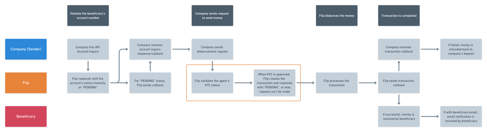

# Agent Money Transfer

<blockquote>
  
</blockquote>

<blockquote>
  

    Note: Flip will validate the Agent’s KYC status for every disbursement request. Only approved Agents can request to transfer money via Flip.
  

</blockquote>

While there is a significant distinction between [Money Transfer](#money-transfer) and [Special Money Transfer](#special-money-transfer), there is only one little difference between Special Money Transfer and Agent Transfer. The difference lies in the availability of the PJP (Penyedia Jasa Pembayaran) license. To put it simply, Agent Money Transfer is a disbursement type of Special Money Transfer for companies who don’t hold a PJP license but want to provide disbursement service for its users.

In this model, Flip as PTD license holder is responsible for the entire flow from the user KYC to money transfer processing. The difference between Agent Money Transfer with other disbursements is that Flip will verify the user KYC and will only process transactions from approved users. Please refer to [this section](#agent-verification) to understand the flow of Agent Verification.

Below is a flow overview on how Agent Money Transfer disbursement works via API.
