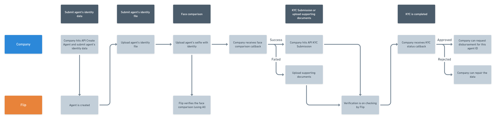

# Agent Verification

<blockquote>
  
</blockquote>

Within this section you will find a set of APIs to have your Agent KYC-ed by Flip prior to creating disbursement with Agent Money Transfer disbursement type. Unlike [Special Money Transfer](#special-money-transfer), the KYC done by Flip for [Agent Money Transfer](#agent-money-transfer) is required as non-PJP licensed companies usually don’t conduct KYC on their end as mandated by Bank Indonesia.

On the right side is a flow overview on how Agent Verification takes place via API.
