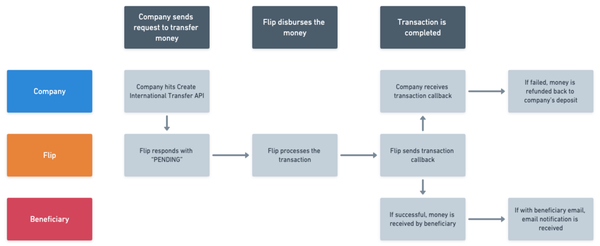

# International Transfer

<blockquote>
  
</blockquote>

Hi, welcome to Flip for Business International Transfer API!

This International Transfer API solution is intended for businesses, especially money transfer operators, who want to facilitate international transfer for their users in a cost-efficient, secured, and faster manner.

In this version of APIs, we provide all transaction types remittance: C2C, C2B, B2C, and B2B. We currently have several corridors and it will continue to grow.

**Flow Overview**

1. Select the destination country and input amount to see the exchange rate, transfer fee, and other details. You can hit **API Get Exchange Rate** to get these details.
2. Visit this **[Required Fields document](https://storage.googleapis.com/flip-prod-dbs-assets/templates/International-Transfer-API-Required-Fields.xlsx)**, to see list of required data you need to send to us when creating an international transfer transaction, accordingly to the country and transaction type selected.
3. Use the **API Get Form Data** to get the list of available values of the request attributes, such as `beneficiary_relationships`, `source_of_funds`, etc. The `special_identifiers` attribute consists of the required attributes for the given country.
4. After completing the beneficiary/recipient’s details in the form data, hit **API Create International Transfer** to create and automatically confirm the transaction. Flip will respond with “PENDING” status and then process the transaction.
5. After the transaction is completed, Flip will send the **International Transfer Transaction Callback** to notify you about the transaction status. If the transaction is successful, money is received by the beneficiary. If the transaction is failed, money will be refunded to the company’s deposit.
6. You can also hit **API Get International Transfer Transaction** to get the transaction status and details.

All international transfer transactions and/or the details can be monitored through the Flip for Business dashboard [https://business.flip.id](https://business.flip.id) and various API endpoints.
