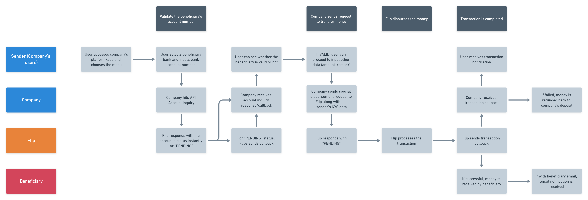

# Special Money Transfer

<blockquote>
  
</blockquote>

Special Money Transfer is a type of disbursement for a company with PJP (Penyedia Jasa Pembayaran) license, operating as a Money Transfer Company (Perusahaan Transfer Dana). While in [Money Transfer](#money-transfer) disbursement the original sender is the company, in Special Money Transfer the original sender is the company’s user.

The main difference regarding the API flow with [Money Transfer](#money-transfer) is in this disbursement type, you are required to provide some of your senders personal information as part of the Know Your Customer (KYC) process mandated by Bank Indonesia.

Below is a flow overview on how Special Money Transfer disbursement works via API.
